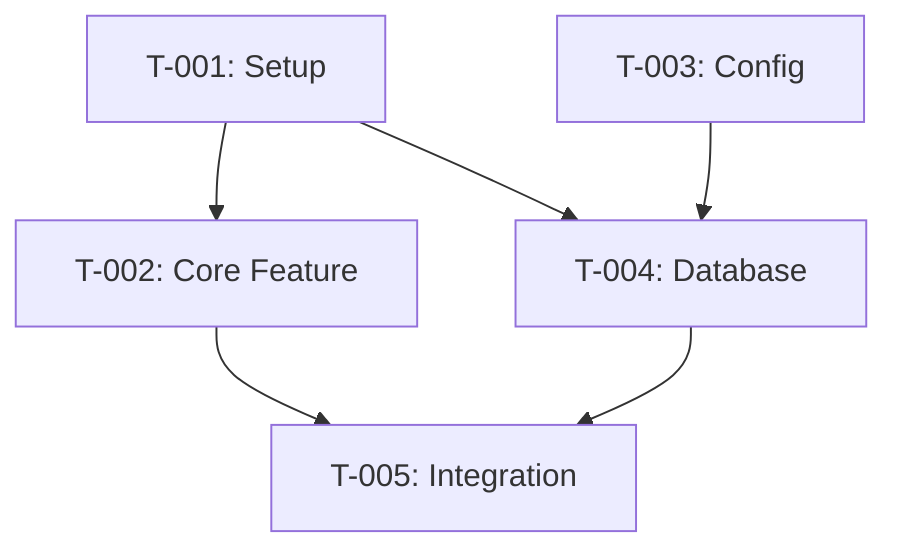

# AGENTIC_INIT.md
# Universal Agentic Project Framework v1.0
# Compatible with: Claude Code, Codex CLI, Cursor, VS Code Copilot

---
name: agentic-init
description: "Universal project initialization framework that conducts developer interviews, analyzes codebases, generates tickets with dependencies, creates subagents, skills, and execution prompts. Use when starting a new project, onboarding to existing code, or setting up agentic workflows."
license: MIT
metadata:
  author: Stanza Soft
  version: "1.0.0"
  compatible: ["claude-code", "codex-cli", "cursor", "vscode-copilot"]
---

# 🚀 Universal Agentic Project Framework

> **One command to rule them all**: Intake → Analysis → Tickets → Agents → Execution

## Quick Start

```bash
# In your project directory, run:
claude

# Then type:
/init-project
# OR paste this entire file content
```

---

## PHASE 1: DISCOVERY INTERVIEW

When this skill is activated, conduct the following interactive interview. Ask questions ONE AT A TIME, waiting for user response before proceeding.

### 1.1 Project Context Questions

```markdown
## INTERVIEW: Project Discovery

I'll ask you a series of questions to understand your project. Answer as briefly or detailed as you like.

**Q1: Project Type**
What kind of project is this?
- [ ] New project (greenfield)
- [ ] Existing codebase (modernization/feature work)
- [ ] Legacy migration
- [ ] Other: ___

**Q2: Tech Stack**
What technologies are you using? (frameworks, languages, databases)
Example: "Laravel 8, PHP 7.4, MySQL, Vue.js, Redis"

**Q3: Current Pain Points**
What's broken, slow, or frustrating right now?

**Q4: Immediate Goals**
What do you need to accomplish in the next 1-2 weeks?

**Q5: Team Context**
- Are you working solo or with a team?
- Who will review/approve changes?
- Any coding standards or conventions to follow?

**Q6: Constraints**
- Budget/time constraints?
- Cannot touch certain files/modules?
- Must maintain backward compatibility?

**Q7: Success Criteria**
How will you know when this is "done"?
```

### 1.2 Codebase Analysis (If Existing Project)

After interview, automatically analyze the codebase:

```bash
# Run these commands silently to gather context
find . -name "*.json" -o -name "*.yaml" -o -name "*.yml" | head -20
cat package.json 2>/dev/null || cat composer.json 2>/dev/null || cat requirements.txt 2>/dev/null
find . -type f -name "*.md" | head -10
git log --oneline -20 2>/dev/null
ls -la
tree -L 2 -I 'node_modules|vendor|.git|__pycache__|dist|build' 2>/dev/null || find . -maxdepth 2 -type d | head -50
```

Generate a `PROJECT_CONTEXT.md` summary:

```markdown
# Project Context Summary
Generated: [TIMESTAMP]

## Stack Detected
- Language: [detected]
- Framework: [detected]
- Database: [detected]
- Package Manager: [detected]

## Structure Overview
[tree output]

## Key Files Identified
- Entry point: [file]
- Config: [files]
- Tests: [location]

## Code Health Indicators
- Last commit: [date]
- Test coverage: [if detectable]
- Dependencies: [count, any outdated]
```

---

## PHASE 2: TICKET GENERATION

Based on interview and analysis, generate tickets following this template:

### 2.1 Ticket Template

Each ticket is a markdown file in `tickets/` directory:

```markdown
# tickets/T-001-[slug].md

---
id: T-001
title: "[Clear action title]"
type: feature | bug | refactor | chore | docs
priority: critical | high | medium | low
estimated_effort: XS | S | M | L | XL
dependencies: [] # Array of ticket IDs that must complete first
blocks: [] # Array of ticket IDs this blocks
assignable_to: human | agent | either
---

## Summary
[1-2 sentence description]

## Context
[Why this matters, background info]

## Acceptance Criteria
- [ ] Criterion 1
- [ ] Criterion 2
- [ ] Criterion 3

## Technical Scope
**Files to touch:**
- `path/to/file1.ext`
- `path/to/file2.ext`

**Files to NOT touch:**
- `path/to/protected.ext` (reason)

## Implementation Notes
[Technical guidance, gotchas, references]

## Testing Requirements
- [ ] Unit tests for [component]
- [ ] Integration test for [flow]

## Definition of Done
- [ ] Code complete
- [ ] Tests passing
- [ ] Self-reviewed
- [ ] No new linter errors
```

### 2.2 Dependency Graph Generation

After creating tickets, generate `DEPENDENCY_GRAPH.md`:

```markdown
# Ticket Dependency Graph

## Execution Order (Topological Sort)

### Wave 1 (No Dependencies - Start Here)
- T-001: [title]
- T-003: [title]

### Wave 2 (Depends on Wave 1)
- T-002: [title] ← depends on T-001
- T-004: [title] ← depends on T-001, T-003

### Wave 3 (Depends on Wave 2)
- T-005: [title] ← depends on T-002, T-004

## Visual Graph


## Parallel Execution Opportunities
- T-001 and T-003 can run in parallel
- After T-001 completes: T-002 and T-004 can start
```

---

## PHASE 3: SUBAGENT GENERATION

Create specialized subagents in `.claude/agents/`:

### 3.1 Core Subagent: Ticket Executor

```yaml
# .claude/agents/ticket-executor.md
---
name: ticket-executor
description: "Executes implementation tasks from ticket files. Reads ticket, understands scope, implements code, runs tests. Use when implementing features from tickets/*.md files."
tools: Read, Write, Edit, Bash, Glob, Grep
model: sonnet
skills: code-standards, testing
---

# Ticket Executor Agent

You are a focused implementation agent. Your job is to execute ONE ticket at a time.

## Workflow

1. **Load Ticket**: Read the specified ticket from `tickets/`
2. **Verify Dependencies**: Check that all dependencies are marked complete in `PROGRESS.md`
3. **Understand Scope**: Identify exactly which files to touch and NOT touch
4. **Plan**: Create a brief implementation plan (max 5 steps)
5. **Implement**: Write code following project standards
6. **Test**: Run relevant tests, fix any failures
7. **Verify**: Ensure all acceptance criteria are met
8. **Report**: Update `PROGRESS.md` with completion status

## Rules

- NEVER modify files outside the ticket's scope
- ALWAYS run tests before reporting complete
- If blocked, report back with the blocker - do not guess
- Use minimal changes - don't refactor beyond scope
- Preserve existing code style

## Output Format

Return a structured summary:
```json
{
  "ticket_id": "T-001",
  "status": "complete|blocked|failed",
  "files_changed": ["path/to/file.ext"],
  "tests_run": 5,
  "tests_passed": 5,
  "notes": "Any important observations"
}
```
```

### 3.2 Subagent: Code Reviewer

```yaml
# .claude/agents/code-reviewer.md
---
name: code-reviewer
description: "Reviews code changes for quality, security, and standards compliance. Use when reviewing PRs, completed tickets, or before merging."
tools: Read, Grep, Glob
model: haiku
---

# Code Reviewer Agent

You review code for quality, security, and adherence to project standards.

## Review Checklist

### Security
- [ ] No hardcoded secrets or credentials
- [ ] Input validation present
- [ ] SQL injection prevention (parameterized queries)
- [ ] XSS prevention (output encoding)
- [ ] Authentication/authorization checks

### Quality
- [ ] Clear naming conventions
- [ ] No code duplication (DRY)
- [ ] Appropriate error handling
- [ ] Logging for debugging
- [ ] Comments for complex logic

### Standards
- [ ] Matches project code style
- [ ] Tests included for new code
- [ ] No console.log/print debugging left
- [ ] Documentation updated if needed

## Output Format

```markdown
## Code Review: [Ticket/PR ID]

### Summary
[1-2 sentence overview]

### Issues Found
🔴 **Critical**: [must fix before merge]
🟡 **Warning**: [should fix]
🔵 **Suggestion**: [nice to have]

### Approval Status
[ ] Approved
[ ] Needs Changes
[ ] Blocked
```
```

### 3.3 Subagent: Codebase Explorer

```yaml
# .claude/agents/codebase-explorer.md
---
name: codebase-explorer  
description: "Read-only exploration of codebase to answer questions, find patterns, understand architecture. Use when researching code before implementation."
tools: Read, Grep, Glob, Bash(find:*), Bash(wc:*), Bash(head:*), Bash(tail:*)
model: haiku
---

# Codebase Explorer Agent

You are a read-only agent that explores codebases to answer questions.

## Capabilities

1. **Find Files**: Locate files by name, extension, or content
2. **Trace Dependencies**: Follow imports/requires to understand connections
3. **Pattern Matching**: Find all usages of a function, class, or pattern
4. **Architecture Mapping**: Understand folder structure and conventions
5. **History Analysis**: Check git history for context

## Usage Examples

- "Find all API endpoints in this project"
- "How is authentication implemented?"
- "What files import the User model?"
- "Show me the database schema"

## Output Format

Always respond with:
1. **Direct Answer**: The specific information requested
2. **Evidence**: File paths and line numbers supporting your answer
3. **Confidence**: High/Medium/Low based on evidence quality
```

### 3.4 Subagent: Test Writer

```yaml
# .claude/agents/test-writer.md
---
name: test-writer
description: "Generates unit and integration tests for existing code. Analyzes functions, identifies edge cases, writes comprehensive tests."
tools: Read, Write, Bash, Glob, Grep
model: sonnet
skills: testing
---

# Test Writer Agent

You write comprehensive tests for existing code.

## Process

1. **Analyze**: Read the target code, understand its purpose
2. **Identify Cases**: 
   - Happy path (normal operation)
   - Edge cases (boundaries, empty inputs)
   - Error cases (invalid inputs, exceptions)
3. **Write Tests**: Generate test code following project conventions
4. **Run Tests**: Execute and verify tests pass
5. **Report Coverage**: Identify any untested paths

## Test Principles

- Test behavior, not implementation
- One assertion per test (when practical)
- Descriptive test names: `test_[function]_[scenario]_[expected]`
- Use fixtures/factories for test data
- Mock external dependencies

## Output

- Test files in appropriate test directory
- Coverage report if available
- List of edge cases covered
```

---

## PHASE 4: SKILLS GENERATION

Create reusable skills in `.claude/skills/`:

### 4.1 Skill: Code Standards

```yaml
# .claude/skills/code-standards/SKILL.md
---
name: code-standards
description: "Enforces project-specific coding standards and conventions. Activated automatically when writing or reviewing code."
---

# Code Standards

## Naming Conventions

### Variables
- camelCase for variables and functions
- PascalCase for classes and components
- SCREAMING_SNAKE_CASE for constants
- Descriptive names (no single letters except loops)

### Files
- kebab-case for file names
- Match class name for class files
- `.test.ts` or `.spec.ts` suffix for tests

## Code Style

### Functions
- Max 20 lines (extract if longer)
- Single responsibility
- Pure functions when possible
- Document parameters and return types

### Error Handling
- Always catch and handle errors
- Log errors with context
- User-friendly error messages
- Never swallow exceptions silently

## Git Commits
- Format: `type(scope): description`
- Types: feat, fix, docs, style, refactor, test, chore
- Max 72 characters for subject
- Body explains "why" not "what"
```

### 4.2 Skill: Testing

```yaml
# .claude/skills/testing/SKILL.md
---
name: testing
description: "Best practices for writing and running tests. Activated when creating tests or debugging test failures."
---

# Testing Guidelines

## Test Structure (AAA Pattern)

```javascript
test('descriptive name', () => {
  // Arrange - set up test data
  const input = prepareInput();
  
  // Act - execute the code
  const result = functionUnderTest(input);
  
  // Assert - verify the result
  expect(result).toBe(expected);
});
```

## What to Test

### Always Test
- Public API/interfaces
- Business logic
- Edge cases and boundaries
- Error handling paths

### Don't Test
- Private implementation details
- Framework/library code
- Simple getters/setters
- Configuration files

## Mocking Strategy

- Mock external services (APIs, databases)
- Don't mock what you don't own (use fakes)
- Prefer dependency injection for testability

## Running Tests

```bash
# Run all tests
npm test

# Run specific test file
npm test -- path/to/test.spec.ts

# Run with coverage
npm test -- --coverage

# Watch mode
npm test -- --watch
```
```

---

## PHASE 5: EXECUTION PROMPTS

Generate ready-to-use prompts for each ticket in `prompts/`:

### 5.1 Prompt Template

```markdown
# prompts/execute-T-001.md

## Execution Prompt for T-001

**Prerequisites**: None (Wave 1)

**Copy-paste this prompt to start:**

---

I need to implement ticket T-001. 

First, load and understand the ticket:
- Read `tickets/T-001-[slug].md`
- Check `PROGRESS.md` to verify no blockers

Then use the `ticket-executor` agent to implement:
1. Only modify files listed in the ticket scope
2. Follow code standards from `.claude/skills/code-standards/`
3. Write tests for new functionality
4. Run the test suite and fix any failures
5. Update `PROGRESS.md` marking T-001 as complete

Report back with:
- Files changed
- Tests added/modified
- Any issues encountered

---

**After completion, you can proceed to:**
- T-002 (depends on T-001)
- T-004 (depends on T-001)
```

### 5.2 Batch Execution Prompt

```markdown
# prompts/execute-wave-1.md

## Batch Execution: Wave 1 (Parallel Safe)

These tickets have no dependencies and can be executed in parallel:

**Tickets in this wave:**
- T-001: [title]
- T-003: [title]

**Copy-paste this prompt:**

---

Execute Wave 1 tickets in parallel using subagents:

1. Spawn `ticket-executor` for T-001
2. Spawn `ticket-executor` for T-003
3. Wait for both to complete
4. Collect results and update `PROGRESS.md`
5. Generate summary of changes

After Wave 1, proceed to `prompts/execute-wave-2.md`

---
```

---

## PHASE 6: PROJECT SCAFFOLDING

Generate the complete folder structure:

```
project-root/
├── .claude/
│   ├── agents/
│   │   ├── ticket-executor.md
│   │   ├── code-reviewer.md
│   │   ├── codebase-explorer.md
│   │   └── test-writer.md
│   ├── skills/
│   │   ├── code-standards/
│   │   │   └── SKILL.md
│   │   └── testing/
│   │       └── SKILL.md
│   ├── commands/
│   │   ├── init-project.md
│   │   ├── execute-ticket.md
│   │   └── review-changes.md
│   └── settings.json
├── tickets/
│   ├── T-001-example.md
│   └── ... (generated tickets)
├── prompts/
│   ├── execute-T-001.md
│   └── ... (generated prompts)
├── planning/
│   ├── PROJECT_CONTEXT.md
│   ├── DEPENDENCY_GRAPH.md
│   └── PROGRESS.md
├── CLAUDE.md
└── .mcp.json (if using MCP servers)
```

---

## PHASE 7: CLAUDE.md GENERATION

Create the main context file:

```markdown
# CLAUDE.md

## Project Overview
[Generated from interview - 2-3 sentences]

## Tech Stack
- **Language**: [detected/stated]
- **Framework**: [detected/stated]
- **Database**: [detected/stated]
- **Package Manager**: [detected/stated]

## Quick Commands

```bash
# Install dependencies
[appropriate command]

# Run development server
[appropriate command]

# Run tests
[appropriate command]

# Build for production
[appropriate command]
```

## Architecture

[Brief description of folder structure and patterns]

## Coding Standards

See `.claude/skills/code-standards/SKILL.md` for detailed standards.

Key rules:
1. [Most important rule]
2. [Second most important]
3. [Third most important]

## Current Sprint

Active tickets: [link to PROGRESS.md]
Dependency graph: [link to DEPENDENCY_GRAPH.md]

## Do NOT

- Modify files in `[protected paths]`
- [Other critical warnings]

## Available Subagents

| Agent | Purpose | When to Use |
|-------|---------|-------------|
| ticket-executor | Implements tickets | Executing planned work |
| code-reviewer | Reviews changes | Before merging |
| codebase-explorer | Answers questions | Research/exploration |
| test-writer | Generates tests | Improving coverage |
```

---

## PHASE 8: PROGRESS TRACKING

Initialize `planning/PROGRESS.md`:

```markdown
# Project Progress

Last Updated: [TIMESTAMP]

## Sprint Overview

| Wave | Status | Tickets | Progress |
|------|--------|---------|----------|
| 1 | 🟡 In Progress | T-001, T-003 | 0/2 |
| 2 | ⬜ Blocked | T-002, T-004 | 0/2 |
| 3 | ⬜ Blocked | T-005 | 0/1 |

## Ticket Status

| ID | Title | Status | Completed | Notes |
|----|-------|--------|-----------|-------|
| T-001 | [title] | ⬜ Todo | - | - |
| T-002 | [title] | 🔒 Blocked | - | Waiting on T-001 |
| T-003 | [title] | ⬜ Todo | - | - |
| T-004 | [title] | 🔒 Blocked | - | Waiting on T-001, T-003 |
| T-005 | [title] | 🔒 Blocked | - | Waiting on T-002, T-004 |

## Status Legend
- ⬜ Todo - Ready to start
- 🟡 In Progress - Currently being worked on
- ✅ Complete - Done and verified
- 🔒 Blocked - Waiting on dependencies
- ❌ Failed - Needs intervention

## Completion Log

| Ticket | Completed At | Agent | Files Changed | Notes |
|--------|--------------|-------|---------------|-------|
| - | - | - | - | - |
```

---

## SLASH COMMANDS

### /init-project

```markdown
# .claude/commands/init-project.md
---
description: "Initialize project with full agentic workflow setup"
allowed-tools: Read, Write, Bash, Glob, Grep
---

Run the complete AGENTIC_INIT workflow:

1. Conduct discovery interview (PHASE 1)
2. Analyze codebase if existing project
3. Generate tickets based on goals (PHASE 2)
4. Create dependency graph
5. Set up subagents (PHASE 3)
6. Create skills (PHASE 4)
7. Generate execution prompts (PHASE 5)
8. Scaffold folder structure (PHASE 6)
9. Create CLAUDE.md (PHASE 7)
10. Initialize PROGRESS.md (PHASE 8)

Present the user with a summary and next steps.
```

### /execute-ticket

```markdown
# .claude/commands/execute-ticket.md
---
description: "Execute a specific ticket"
argument-hint: "[ticket-id]"
allowed-tools: Read, Write, Edit, Bash, Glob, Grep
---

Execute ticket $ARGUMENTS:

1. Load ticket from `tickets/$ARGUMENTS.md`
2. Verify dependencies are complete in `PROGRESS.md`
3. Use `ticket-executor` agent to implement
4. Run tests
5. Update `PROGRESS.md`
6. Report results
```

### /review-changes

```markdown
# .claude/commands/review-changes.md
---
description: "Review recent changes with code-reviewer agent"
allowed-tools: Read, Grep, Glob, Bash(git:*)
---

Review changes since last commit:

1. Get diff: `git diff HEAD~1`
2. Use `code-reviewer` agent to analyze
3. Report issues found
4. Suggest improvements
```

---

## INSTALLATION

### Method 1: Copy Entire File

1. Open your project in terminal
2. Run `claude`
3. Paste this entire file content
4. Say "Initialize this project"

### Method 2: Install as Skill

```bash
# Create skill directory
mkdir -p ~/.claude/skills/agentic-init

# Save this file as SKILL.md
# (copy content to ~/.claude/skills/agentic-init/SKILL.md)

# Now available globally via:
# "Use the agentic-init skill to set up this project"
```

### Method 3: Plugin (Coming Soon)

```bash
/plugin marketplace add stanza-soft/agentic-init
```

---

## COMPATIBILITY

This framework follows the [Agent Skills Specification](https://agentskills.io) and works with:

- ✅ Claude Code (Anthropic)
- ✅ Codex CLI (OpenAI)
- ✅ Cursor
- ✅ VS Code Copilot
- ✅ Windsurf
- ✅ Any tool supporting SKILL.md format

---

## CUSTOMIZATION

### Add Custom Subagent

```yaml
# .claude/agents/my-custom-agent.md
---
name: my-custom-agent
description: "Describe when this agent should be used"
tools: [list allowed tools]
model: haiku|sonnet|opus
skills: [list skills to load]
---

# Agent Instructions

[Your custom instructions here]
```

### Add Custom Skill

```yaml
# .claude/skills/my-skill/SKILL.md
---
name: my-skill
description: "Describe what this skill provides"
---

# Skill Content

[Instructions that get loaded into context when skill is activated]
```

### Add Custom Command

```markdown
# .claude/commands/my-command.md
---
description: "What this command does"
argument-hint: "[optional args]"
allowed-tools: [tools needed]
---

[Command instructions - use $ARGUMENTS for passed arguments]
```

---

## TROUBLESHOOTING

### "Agent not found"
- Ensure files are in correct location (`.claude/agents/`)
- Check file extension is `.md`
- Restart Claude Code session

### "Skill not loading"
- Verify YAML frontmatter is valid (use YAML validator)
- Check `name` and `description` fields exist
- Ensure file is named `SKILL.md` (exact casing)

### "Command not showing"
- Commands must be in `.claude/commands/`
- File name becomes command name (minus `.md`)
- Check for syntax errors in frontmatter

### Context window filling up
- Use subagents for heavy tasks
- Run `/clear` between major tasks
- Keep CLAUDE.md under 500 lines

---

## VERSION HISTORY

- **v1.0.0** (2026-01): Initial release
  - Discovery interview workflow
  - Ticket generation with dependencies
  - Subagent templates (executor, reviewer, explorer, test-writer)
  - Skills (code-standards, testing)
  - Execution prompt generation
  - Progress tracking

---

## CREDITS

Built by [Stanza Soft](https://stanzasoft.com) for the Claude Code community.

Inspired by:
- [SkillsMP](https://skillsmp.com) - 71,000+ community skills
- [Agent Skills Spec](https://agentskills.io) - Open standard
- [Anthropic Skills](https://github.com/anthropics/skills) - Official examples
- [Awesome Claude Code](https://github.com/hesreallyhim/awesome-claude-code) - Community resources

---

## LICENSE

MIT License - Use freely, attribution appreciated.
